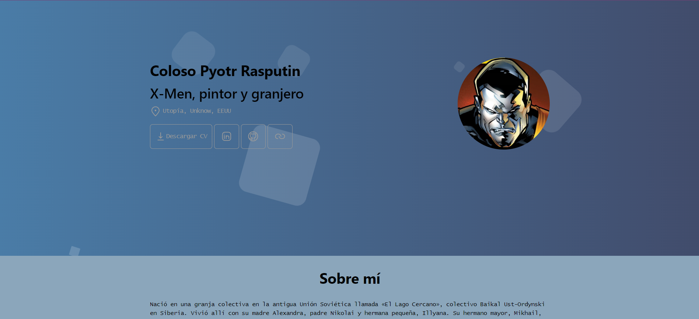

<div align="center">
<h1>Creador de portfolios con el JSON descargable de Manfred</h1>
</img>
</div>

# ⭐ Objetivo del proyecto:

El objetivo es que cualquier persona pueda crear un potfolio web atractivo y mantenerlo actualizado gracias a que su contenido va a venir desde el json descargable de [Manfred](https://www.getmanfred.com/).

Puedes ver un **ejemplo** en [mi propia web](https://mzrdeveloper.com/) o en el [ejemplo de Coloso](https://master--example-astro-manfred-cv.netlify.app/).

# 🚀 Empezamos

Este proyecto usa [Node.js](https://nodejs.org/en), y [Astro](https://astro.build/), si no estas familiarizado con ello no te procupes, no tienes porque tocar el código, pero si que tendrás que instalar [Node.js](https://nodejs.org/en).

Si ya tienes conocimiento de estas tecnologías verás que toda la plantilla esta creada utilizando el menor número de dependencias posibles y seguro que puedes modificar o crear tus propias secciones de una manera muy sencilla.

Según el contenido que quieras presentar en tu web hay varios archivos que debes configurar:

## 🛠️ Configuración básica

Crea un perfil en [Manfred](https://www.getmanfred.com/) y descargar el perfil como json.

Renombra el archivo a **cv.json** y añadelo a la carpeta **config** en la raíz del proyecto.

Añade también tu curriculum en pdf a la carpeta **config**, su nombre debe ser **cv.pdf**, lo puedes descargar de [LinekdIn](https://www.linkedin.com/) o de [Manfred](https://www.getmanfred.com/).

Crea un archivo **.env** en la raíz del proyecto con el siguiente contenido:

```
PUBLIC_SHOW_SKILLS=Y # Y or N
PUBLIC_SHOW_PROJECTS=Y # Y or N
PUBLIC_SHOW_EDUCATION=N # Y or N
PUBLIC_SHOW_LANGUAGES=N # Y or N
PUBLIC_SHOW_RECOMMENDED=Y # Y or N
PUBLIC_EMAIL="" # OPCIONAL Tu email
PUBLIC_PHONE="" # OPCIONAL Tu teléfono
```

## 👀 Datos y secciones adicionales

El perfil de Manfred no cubre todas las secciones que quizás querrás presentar en tu cv online (como tus recomendaciones), por ello puedes añadir un archivo **recommended.json** a la carpeta config, con la siguiente estructura:

```json
{
  "recomendations": [
    {
      "firstName": "Name",
      "lastName": "lastname lastname",
      "img": "valid URL",
      "company": "Company name",
      "jobTitle": "Position",
      "text": "Content",
      "createdAt": "02/19/24, 12:06 PM"
    }
  ]
}
```

## 🖌️ Edición del tema (colores)

Opcionalmente puedes dejar los colores por defecto o modificalos en el **styles.json**, la estructura es la siguiente:

```json
{
  "colors": {
    "bgColor": "#4B1248", // Color de fondo.
    "fontColor": "#bbb", // Color de la fuente.
    "titlesColor": "#fff", // Color de los títulos.
    "secondaryFontColor": "#999", // Color de los subtítulos.
    "heroTitle": "#fff", // Color de los fuente del título de la sección hero.
    "heroSecondary": "#4B1248", // Color de los fuente de los subtítulos de la sección hero.
    "heroFrom": "#F0C27B", // Color en el que comenzará el gradiante de fondo de la sección hero.
    "heroTo": "#4B1248", // Color en el que finaliza el gradiante de fondo de la sección hero.
    "secondaryBg": "#000" // Color del fondo secundario.
  }
}
```

## 🎉 Deploy

Si quieres deplegarlo, te recomiendo hacerte un fork de este proyecto, **dejar tu estrellita** y hacer deploy con [Netlify](https://www.netlify.com/)

# 📜 Comandos:

Instala dependencias:

> npm install

Puedes probar en local con el siguiente comando y arbir [**http://localhost:4321**](http://localhost:4321/) en tu navegador para ver el resultado:

> npm run dev

Puedes construir una build con el comando, los resultados aparecerán en la carpeta **dist**:

> npm run build

# ☄️ Roadmap

- ~~Añadir opciones de estilo y estilos menos minimalistas~~

- ~~Añadir panel de proyectos~~

- ~~Añadir cv descargable~~

- ~~Añadir sección recomendados~~

- Añadir soporte **Multilenguaje**

# ❤️ Créditos

Basado en el proyecto: https://github.com/midudev/minimalist-portfolio-json/tree/main
